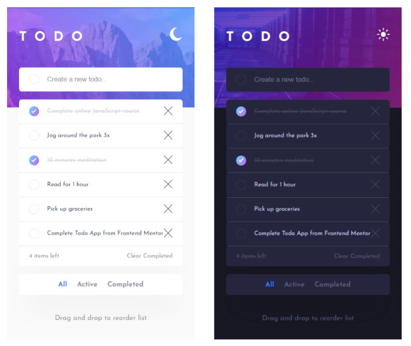
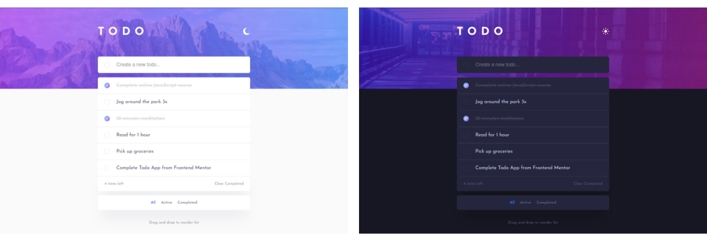

# Frontend Mentor - Todo app solution

This is a solution to the [Todo app challenge on Frontend Mentor](https://www.frontendmentor.io/challenges/todo-app-Su1_KokOW).

## Table of contents

- [Overview](#overview)
  - [The challenge](#the-challenge)
  - [Screenshots](#screenshots)
  - [Links](#links)
- [My process](#my-process)
  - [Built with](#built-with)
  - [What I learned](#what-i-learned)
- [Author](#author)

## Overview

### The challenge

Users should be able to:

- View the optimal layout for the app depending on their device's screen size
- See hover states for all interactive elements on the page
- Add new todos to the list
- Mark todos as complete
- Delete todos from the list
- Filter by all/active/complete todos
- Clear all completed todos
- Toggle light and dark mode
- Drag and drop to reorder items on the list

### Screenshots

#### Mobile Devices

#### Desktop Devices

### Links

- Solution URL (Github): [https://github.com/flying-turtle001/todo-app](https://github.com/flying-turtle001/todo-app)
- Live Site URL: [https://quirky-hodgkin-e3807d.netlify.app/](https://quirky-hodgkin-e3807d.netlify.app/)

## My process

### Built with

- Mobile-first workflow
- [React](https://reactjs.org/) - JS library

This project was bootstrapped with [Create React App](https://github.com/facebook/create-react-app).

In the project directory, you can run:

### `npm start`

Runs the app in the development mode.\
Open [http://localhost:3000](http://localhost:3000) to view it in your browser.

### What I learned

This project served to introduce me to the world of React in a practical way. I put special emphasis on consolidating and expanding the basic concepts and principles of React.

For the styling of the components I decided to use CSS Modules. This allowed me to give each component its own specific style without the risk of influencing other components with this styling.

I made sure to divide the app into as many logical and useful components as possible to test the general workflow and the work with many different components.

To provide the app with additional dynamic and to practice working with third party packages, I decided to provide drag and drop functionality using [react-beautiful-dnd](https://github.com/atlassian/react-beautiful-dnd).

All in all, I learned many things while programming this todo app and was able to consolidate and further expand my knowledge regarding React.

## Author

- Website - [https://sitesandnetwork.com/](https://sitesandnetwork.com/)
- LinkedIn - [https://www.linkedin.com/in/justin-esposito-947108200/](https://www.linkedin.com/in/justin-esposito-947108200/)
